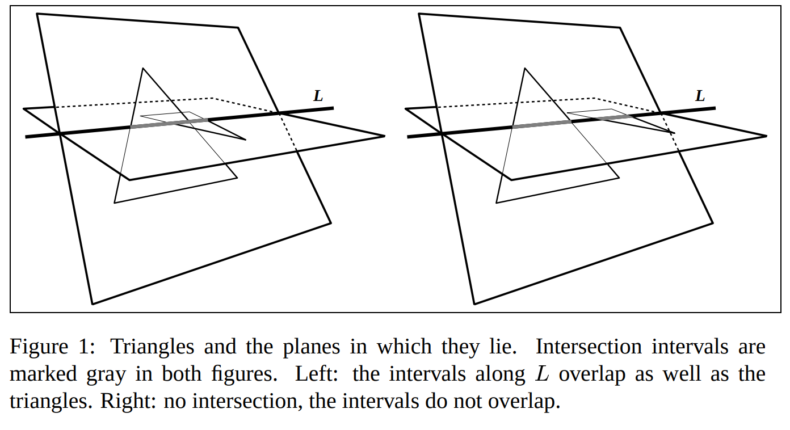
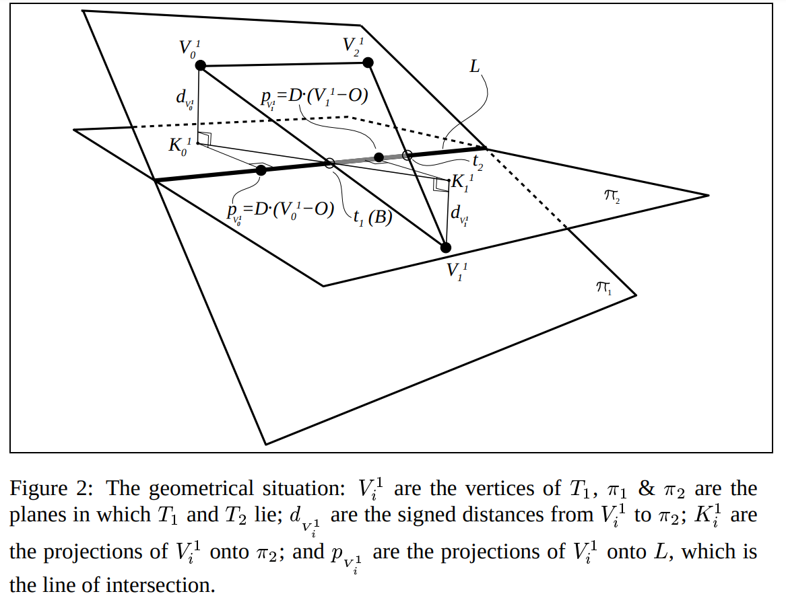
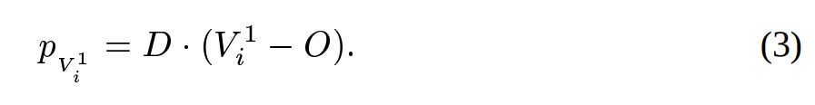
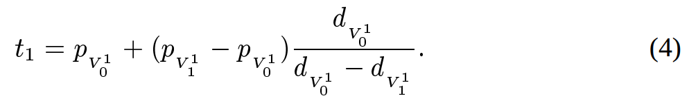

# [Алгоритм Мёллера](http://web.stanford.edu/class/cs277/resources/papers/Moller1997b.pdf) 

## I Случай комлпанарных треугольников (расстояние от каждой вершины T1 до П2 (в которой лежит T2) равно нулю)

### 1 случай
Проверять все ребра Т1 на пересечение со всеми Т2,
если хотя бы одно пересеклось (задача пересечения отрезков из 35 главы, вроде 800 страница [Кормена](https://e-maxx.ru/bookz/files/cormen.pdf))
то соответсвенно треугольники пересекаются.

## 2 случай
Если ни одна пара ребер не пересекается то проверить лежит ли один треугольник внутри другого (это задача проверки принадлежности точки треугольнику)

## II Случай, когда расстояние от каждой вершины T1 до П2 (в которой лежит T2) не равно нулю и одного знака.

В этом случае за счет того что расстояния от вершин до плоскости одного знака T1 лежит на одной стороне П2 и, следовательно, пересечение невозможно.
(попробуй это нарисовать и убедишься что ничего не получается).

 

## III случай, когда не выполнены I и II.
(причем II надо чтобы был не выполнен для обоих треугольников, если II выполнен хотя бы для одного то пересечения треугольников уже не будет).

Пишем уравнение линии пересечения П1 и П2. 
L = O + t * D  
Из II следует , что оба треугольника гарантированно пересекают L.
Эти пересечения образуют интервал на L
Если эти интервалы пересекаются, то треугольники тоже пересекаются.

 

Таким образом нужно найти пересечение между ребрами V10V11 и V11V12.

Аналогичную величину нужно найти и для T2.
Таким образом если эти отрезки в одномере пересекаются, то и треугольники в пространстве пересекаются.

Более подробное описание в статье.
Пока что за формулами обращаться также к статье.

## Вопросы
Я не понял, что имеется ввиду в статье под этой величиной:

 

Говорится что это проекция соответсвующей вершины, но как её использовать (как точку или как расстояние я не понимаю)

Соответсвенно из моего непонимания первого вопроса следует непонимание и этой формулы:

 

Можно принять их на веру без понимания, но тогда не факт что аргоритм будет работать как это задумывалось.

Как я понял нужно посчитать  t1 и  t2
Их разность и будет отрезком пересечения T1 и L.
Аналогично найти отрезок пересечения T2 и L, а потом проверить, пересекаются ли полученные отрезки.